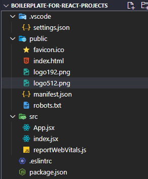

# Ultimate Linting & Formatting Setup for VSCode React Projects 🔥
### ___---inspired form ___

I just made little change. So, every process will be same as Sumit Dada did in his video. Video Link: [Check Now](https://youtu.be/ii8GaRjRoNI)

## What I did
- Changed Package.json so that you can always get essential updated package
- No Error 
- ✨Magic ✨

#### Method -1 :

- Watch and Follow all procedure of that video and run the command and check if you face any error;

    `npm start` if you npm or `yarn start` if you use yarn

if you face error then do the following steps:

- just keep those files and remove the rest.
[]

- then download `.eslintc` and `package.json` form this repo  [Ultimate Solution](https://github.com/moinulmoin/boilerplate-for-react-projects) [you can also download `.vscode` if you need]

- copy and paste and overwrite the files in your working directory 
- then run the command:
    `npm install` if you use  npm or `yarn` if you use yarn
- I hope it will work now. Check it by `npm start` or `yarn start`

if that shows you error, then just do the following method:

#### Method-2

- Just keep a empty directory 
-download the whole repo
-copy and paste the files in your directory
- run the command:
`npm install` if you use  npm or `yarn` if you use yarn
- now check it by `npm start` or `yarn start`
- I hope it is working
 
##### If it's working and worthy, please give a star💫 on this repo
##### if you are still facing error, let me know [Moinul Moin](https://moinulmoin.com)

